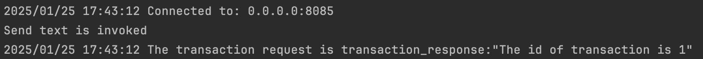
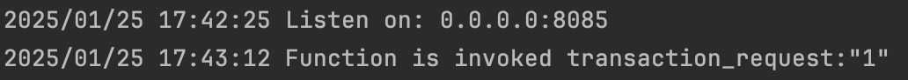
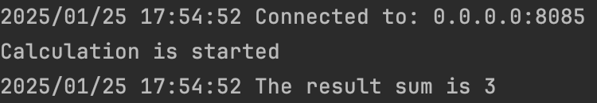

# gRPC

# gRPC Unary

## 1. Test Connection
Implementation of the test connection from client to server, sending a simple message.

### Client Logs

### Server Logs

---

## 2. Calculator Service
Implementation of the calculator service, where the server sends two numbers using a unary connection, and the client returns the sum of these two numbers.

### Client Logs

### Server Logs

